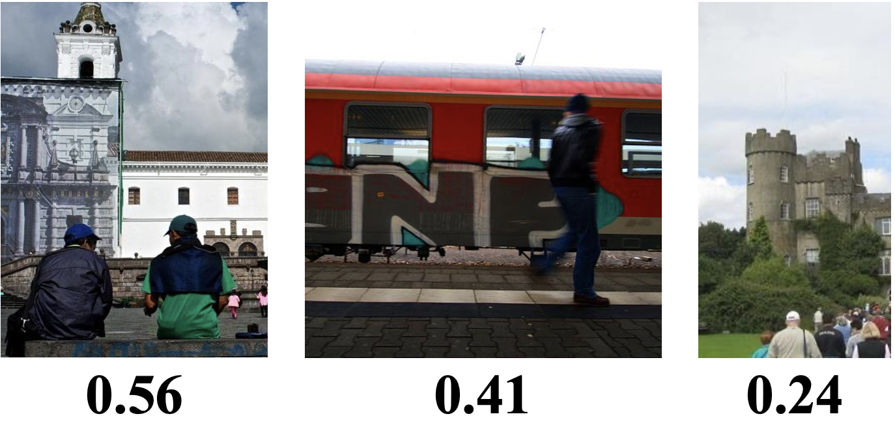

# CSNet-Pytorch
This is an unofficial Pytorch implementation of **Composition Scoring Model** in [Camera View Adjustment Prediction for Improving Image Composition](https://arxiv.org/abs/2104.07608).

# Composition Scoring Model
Composition Scoring Model, which we named as **CSNet**, predicts image composition score(0 ~ 1).

## Performance
There is no evaluation metric in original paper because this model was used only when training view adjustment prediction model.

We used scored crops dataset(GAICD, CPC) as test dataset and calculate the accuracy of judging which image has better composition.

`Gap` in `Accuracy` means a score gap of test image pairs. For example, when `Gap` >= 0.5, the score gap of test image pairs is greater than or equal to 0.5.

| **Image Perturbation** | **Data Augmentation** | **Accuracy(Gap>=0.5)** | **Acccuracy(Gap>=1.0)** |
|:---:|:---:| :---:| :---: |
| Shifting, Zooming-out, Cropping, Rotation | Shift Borders, Zoom-out, Rotation | 71.8% | 76.2%|
| Shifting | Shift Borders | 73.8% | 78.3% |

## Dataset
+ GAICD [[Paper](https://arxiv.org/abs/1904.04441)][[Github](https://github.com/HuiZeng/Grid-Anchor-based-Image-Cropping)]
+ FCDB [[Paper](https://arxiv.org/abs/1701.01480)][[Github](https://github.com/yiling-chen/flickr-cropping-dataset)]
+ CPC [[Paper](https://openaccess.thecvf.com/content_cvpr_2018/papers/Wei_Good_View_Hunting_CVPR_2018_paper.pdf)][[Homepage](https://www3.cs.stonybrook.edu/~cvl/projects/wei2018goods/VPN_CVPR2018s.html)]
+ Unsplash [[Github](https://github.com/unsplash/datasets)]

# Usage
``` bash
git clone https://github.com/PROLCY/CSNet-Pytorch.git
cd CSNet-Pytorch && mkdir weight
```
```bash
pip install -r requirements.txt
```
## Demo
Download pretrained model in the directory ``weight``

| **Image Perturbation** | **Data Augmentation** | **Accuracy(Gap>=1.0)** | **Download** |
|:---:|:---:| :---:| :---: |
| Shifting, Zooming-out, Cropping, Rotation | Shift Borders, Zoom-out, Rotation | 76.2% | [Link](https://drive.google.com/drive/folders/1qbgGw93qx-jwTUB3qVmctCBZzn22bcP8) |
| Shifting | Shift Borders | 78.3% | [Link](https://drive.google.com/drive/folders/11f1hwTsIlmzvcRP4S61F-evYp7TyltTR) |

```bash
python demo.py {image_dir_path}
```
You can check the composition score of images in terminal.
## Result
**Predicted composition scores are as follows.**



**If you are interested in this repository, please contact `ckd248@naver.com`**